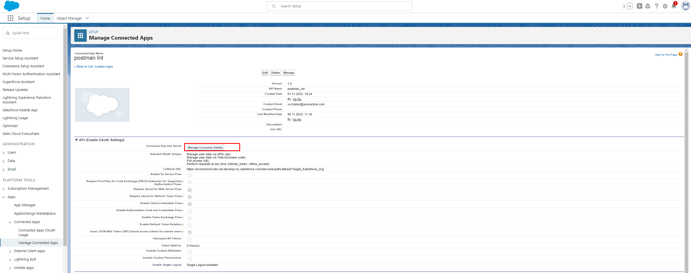
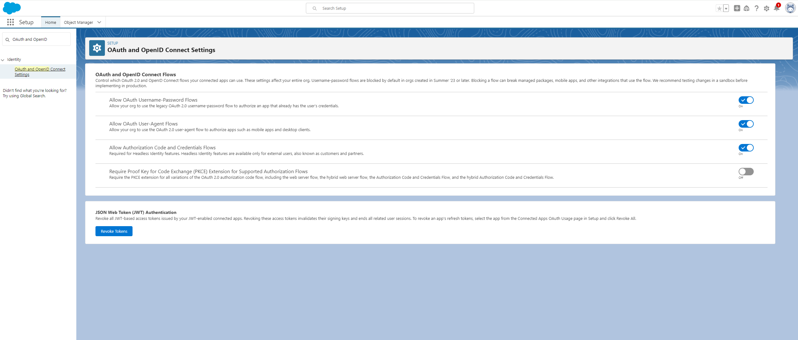

# Salesforce REST API

This connector uses the Salesforce REST API and provides a way to **access** Salesforce resources and **manipulate** objects. 

This connector:

- uses the REST API to process a Salesforce opportunity.
- tracks the status of opportunities
- manipulates opportunities using the Salesforce Object Query Language (SOQL).

## Demo

  1. Login to the Axon Ivy platform
  2. Click **Starts** in the Axon Ivy menu to open the available process starts
  3. Click on **ChartDemo**.
  
  
  
  4. The connector fetches all Salesforce opportunities via the REST API and display them as a bar chart
  
  
  
  5. On the Full Process List, click on **ListDemo**.
  
  
  
  6. Opportunity Overview:
  
  
  
  7. Click on the "Add New" button:
  
  
  
  8. Add new Opportunity:
  
  
  
  9. Click on Opportunity Name to view details:
  
  
  
  10. Opportunity details:
  
  
  
  11. Opportunity details Activity:
  
  
  
  12. Click on the icon Pencil to Update an Opportunity:
  
  
  
  13. Edit Opportunity:
  
  
  
  14. Click on the icon "Trash" to remove an Opportunity:
  
  
  
  15. Delete Opportunity:
  
  

## Setup

### Configuration on Salesforce side
  For a client application to access REST API resources, it must be authorized as a trusted visitor. To implement this authorization, utilize a **Connected App** and employ the **OAuth 2.0** authorization flow.

  **Important steps**

  1. Create a Connected App to generate the necessary authentication information

- Go to **Setup** -> **Apps** -> **App Manager** -> click on button **New Connected App**

  

- Input all needed information

  

- Generate Consumer key And Consumer secret

  

- Configure Client credential flow

  

2. Configure authentication providers for your application
 
- Go to **Setup** -> **Auth.provider** -> **New**

  

3. Activate the required settings in OAuth and OpenID Connect settings to facilitate secure authentication
 
- Go to **Setup** -> **OAuth and OpenID Connect Settings** -> Enable checkboxes

  

4. Set up Named Credentials to manage and secure access to external services
 
- Go to **Setup** -> **Named Credentials** -> **New legacy**

  

### Integrate the connector into your project
  The **Consumer Key** and **Consumer Secret** are retrieved from the **Connected App** and placed in the `variables.yaml` file.

  Authentication information is set up as a global variable and can be updated anytime.

  
  | Variable name                              | Note                                          |Example                                                                               |
  |--------------------------------------------|-----------------------------------------------|--------------------------------------------------------------------------------------|
  |salesforce-connector.auth.subdomain         |The domain that Salesforce provides to consumers for authentication         |axonactive3-dev-ed.develop                                                            |
  |salesforce-connector.auth.clientId          |Consumer Id                                    |3MVG95mg0lk4bathQF4Z_F1GcZZPr8ztvo29c53HhwOXnCKBkP8LkxHnb5KlydXj3Oomw0VHsY |
  |salesforce-connector.auth.clientSecret      |Consumer Secret                                |56C6CA448B49032828FE4C4DF16D1AF4804B8CC734E066B255A5B31A                     |
  |salesforce-connector.auth.useAppPermissions |OAuth2 Grantype                                |true (client_credentials)                                                             |
  |salesforce-connector.auth.url               |Salesforce Rest URI                            |https://axonactive3-dev-ed.develop.my.salesforce.com/services/data/v58.0              |

### Resources
[Developer](https://developer.salesforce.com/docs)

[Connected App](https://help.salesforce.com/s/articleView?id=sf.connected_app_client_credentials_setup.htm&type=5)

[Salesforce SOQL](https://developer.salesforce.com/docs/atlas.en-us.soql_sosl.meta/soql_sosl/sforce_api_calls_soql.htm)

