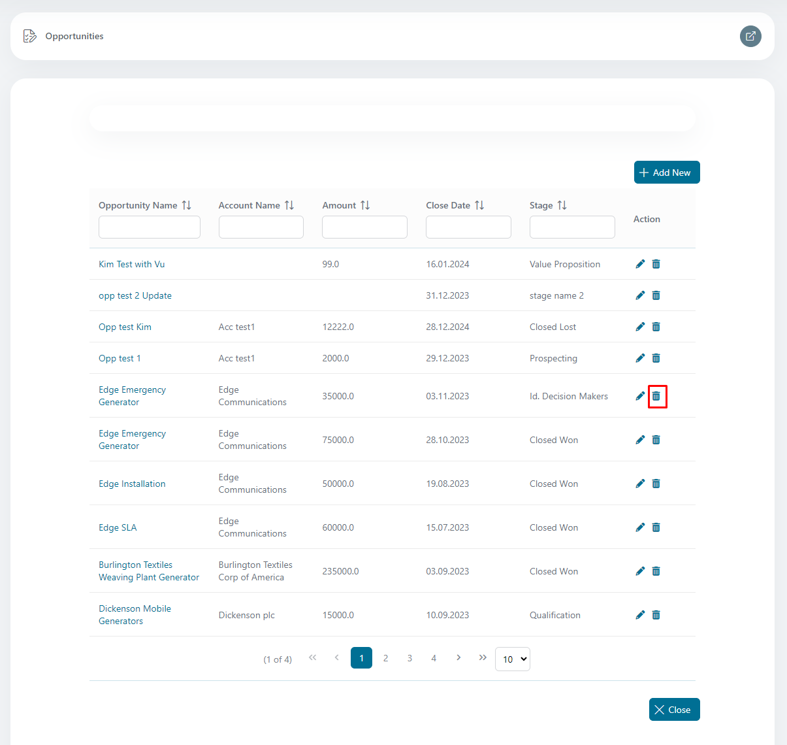

# Salesforce REST API

Dieser Connector nutzt die Salesforce REST API und bietet eine Möglichkeit,
**auf** Salesforce-Ressourcen zuzugreifen und **** Objekte zu bearbeiten.

Dieser Konnektor:

- Verwendet die REST-API, um eine Salesforce-Opportunity zu verarbeiten.
- Verfolgt den Status von Verkaufschancen.
- bearbeitet Opportunities mithilfe der Salesforce Object Query Language (SOQL).

## Demo

  1. Melden Sie sich bei der Axon Ivy-Plattform an.
  2. Klicken Sie im Axon Ivy-Menü auf „ **“ (Prozess starten) und dann auf „**
     “, um die verfügbaren Prozessstarts zu öffnen.
  3. Klicken Sie auf „ **“ ChartDemo**.

  4. Der Konnektor ruft alle Salesforce-Opportunities über die REST-API ab und
     zeigt sie als Balkendiagramm an.

  5. Klicken Sie auf „ **“ unter „ListDemo“**.

  6. In dieser Demo zeigt der Konnektor die Opportunities als Liste an:

  7. Klicken Sie auf die Schaltfläche „Neu hinzufügen“:

  8. Neue Gelegenheit hinzufügen:

  9. Klicken Sie auf „Opportunity Name“, um Details anzuzeigen:

  10. Details zur Stelle:

  11. Details zur Stelle Tätigkeit:

  12. Klicken Sie auf das Symbol „Bleistift“, um eine Opportunity zu
      aktualisieren:

  13. Bearbeitungsmöglichkeit:

  14. Klicken Sie auf das Symbol „Papierkorb“, um eine Gelegenheit zu entfernen:

  15. Löschmöglichkeit:

## Einrichtung

### Konfiguration auf Salesforce-Seite
Damit eine Client-Anwendung auf REST-API-Ressourcen zugreifen kann, muss sie als
vertrauenswürdiger Besucher autorisiert sein. Um diese Autorisierung zu
implementieren, verwenden Sie eine mit **verbundene App** und nutzen Sie den
Autorisierungsablauf „ **” OAuth 2.0**.

**Wichtige Schritte**

  1. Erstellen Sie eine verbundene App, um die erforderlichen
     Authentifizierungsinformationen zu generieren.

- Gehen Sie zu **Einrichtung** -> **Apps** -> **App-Manager** -> Klicken Sie auf
  die Schaltfläche **Neue verbundene App**

  

- Geben Sie alle erforderlichen Informationen ein.

  

- Generieren Sie einen Verbraucherschlüssel und einen Verbrauchersecret.

  

- Client-Anmeldeinformationsfluss konfigurieren

  

2. Konfigurieren Sie Authentifizierungsanbieter für Ihre Anwendung.

- **Gehen Sie zu „ **“ (Einstellungen) „Setup“ (Einrichtung) „** “
  (Benutzerdefinierte Markdown-Datei) „ **“ (Benutzerdefinierte Markdown-Datei)
  „** “ (Benutzerdefinierte Markdown-Datei) „Auth.provider“
  (Authentifizierungsanbieter) „ “ (Ben**

  

3. Aktivieren Sie die erforderlichen Einstellungen in den OAuth- und OpenID
   Connect-Einstellungen, um eine sichere Authentifizierung zu ermöglichen.

- **Gehen Sie zu „ **“ (Einstellungen) „Setup“ (Einrichtung) „** “ (OAuth und
  OpenID Connect) „Settings“ (Einstellungen) „** “ (OAuth und OpenID Connect)
  „Enable“ (Aktivieren) „Checkboxes“ (Kontrollkästchen)

  

4. Richten Sie benannte Anmeldeinformationen ein, um den Zugriff auf externe
   Dienste zu verwalten und zu sichern.

- ** **Gehen Sie zu „ **“ (Einstellungen) „Setup“ (Einrichtung) „** “
  (Benutzerdefinierte Anmeldeinformationen) „** “ (Benutzerdefinierte
  Anmeldeinformationen) „Named Credentials“ (Benannte Anmeldeinformationen) „ “
  (Benutzerdefinierte Anmeldeinformationen) „Named Credentials“ (Ben**

  

### Integrieren Sie den Konnektor in Ihr Projekt.
Der Verbraucher-Schlüssel „ **“** und der Verbraucher-Geheimcode „ **“** werden
aus der verbundenen App „ **“** abgerufen und in die Datei „ `variables.yaml“`
eingefügt.

Die Authentifizierungsinformationen werden als globale Variable eingerichtet und
können jederzeit aktualisiert werden.

| Variablenname                              | Hinweis                                                                            | Beispiel                                                                   |
| ------------------------------------------ | ---------------------------------------------------------------------------------- | -------------------------------------------------------------------------- |
| salesforceConnector.auth.subdomain         | Die Domain, die Salesforce Verbrauchern zur Authentifizierung zur Verfügung stellt | axonactive3-dev-ed.develop                                                 |
| salesforceConnector.auth.clientId          | Verbraucher-ID                                                                     | 3MVG95mg0lk4bathQF4Z_F1GcZZPr8ztvo29c53HhwOXnCKBkP8LkxHnb5KlydXj3Oomw0VHsY |
| salesforceConnector.auth.clientSecret      | Verbrauchergeheimnis                                                               | 56C6CA448B49032828FE4C4DF16D1AF4804B8CC734E066B255A5B31A                   |
| salesforceConnector.auth.useAppPermissions | OAuth2 Grantype                                                                    | true (client_credentials)                                                  |
| salesforceConnector.auth.url               | Salesforce Rest URI                                                                | https://axonactive3-dev-ed.develop.my.salesforce.com/services/data/v58.0   |

> [!HINWEIS] Der variable Pfad `salesforce-connector` wurde ab Version 13 in
> `salesforceConnector` umbenannt.

### Ressourcen
[Entwickler](https://developer.salesforce.com/docs)

[Verbundene
App](https://help.salesforce.com/s/articleView?id=sf.connected_app_client_credentials_setup.htm&type=5)

[Salesforce
SOQL](https://developer.salesforce.com/docs/atlas.en-us.soql_sosl.meta/soql_sosl/sforce_api_calls_soql.htm)

