# Salesforce RUHEN API

Diese Anschluss Nutzungen die Salesforce RUHEN API und versehen einen Weg zu
**greift zu** Salesforce Ressourcen und **manipulieren** Objekte.

Dieser Anschluss:

- Benutzt den REST API zu verarbeiten einen Salesforce Gelegenheit.
- #Rückverfolgen den Zustand Gelegenheiten
- Manipuliert Gelegenheiten benutzend die Salesforce Einwenden #Abfragen Sprache
  (SOQL).

## Demo

  1. Anmeldung zu den #Axon Efeu Bahnsteig
  2. Klicken **Starts** in den #Axon Efeu Speisekarte zu öffnen den verfügbaren
     Arbeitsgang Starts
  3. Klick weiter **ChartDemo**.

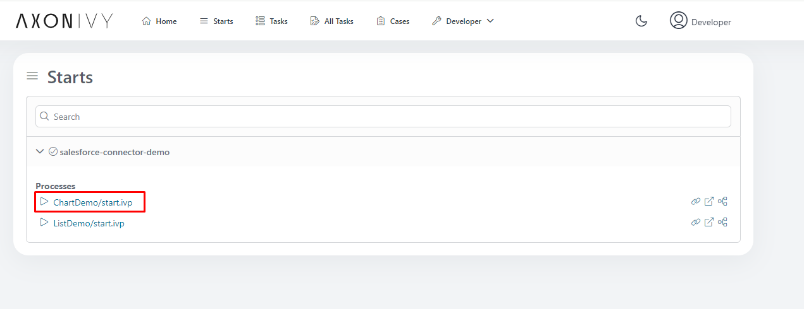

  4. Der Anschluss holt alle Salesforce Gelegenheiten via den REST API und
     zeigen jene da einen Bar Chart

  5. Klick weiter **ListDemo**.

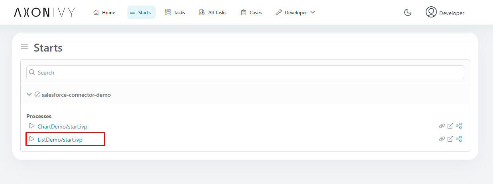

  6. In dieser Demo der Anschluss zeigt die Gelegenheiten da listen:

  7. Klicken weiter das "Zufügen Neuen" Knopf:

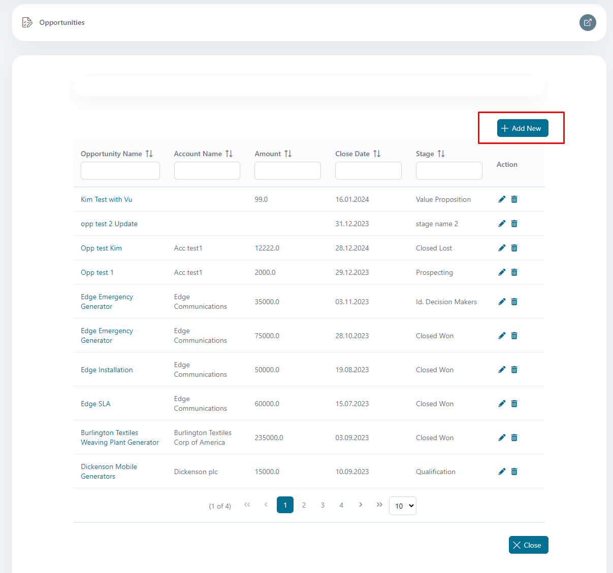

  8. Füg zu eine neue Gelegenheit:

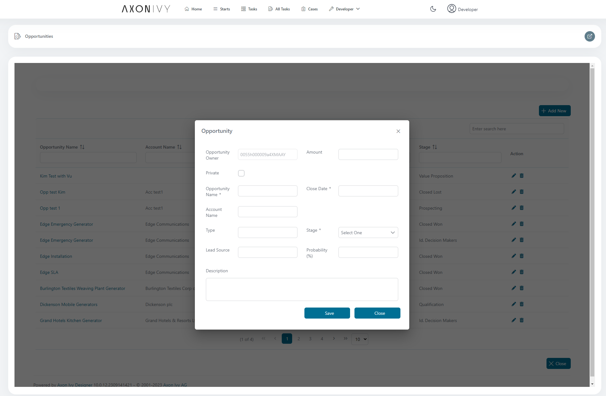

  9. Klickt auf Gelegenheit Heißt zu anschauen Details:

  10. Gelegenheit Details:

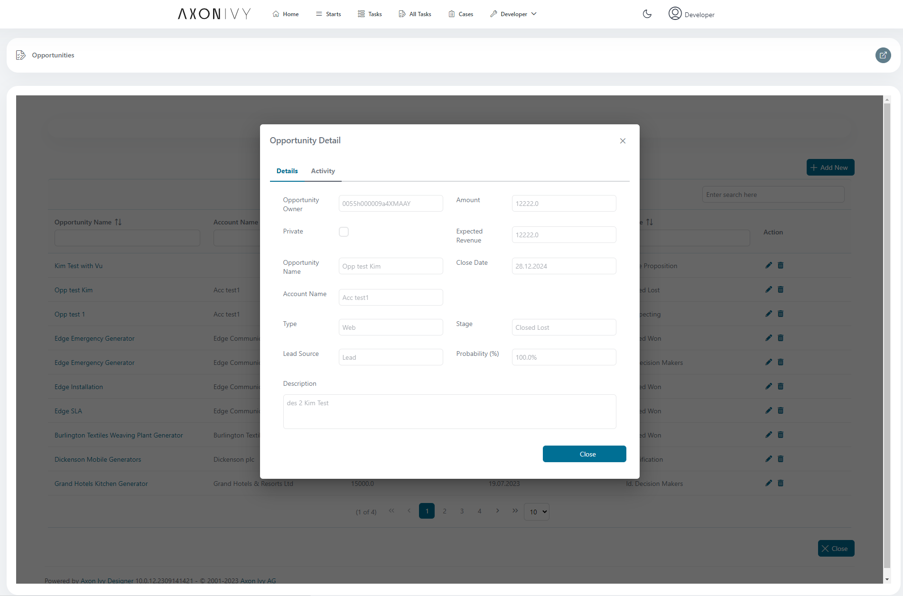

  11. Gelegenheit Details Aktivität:

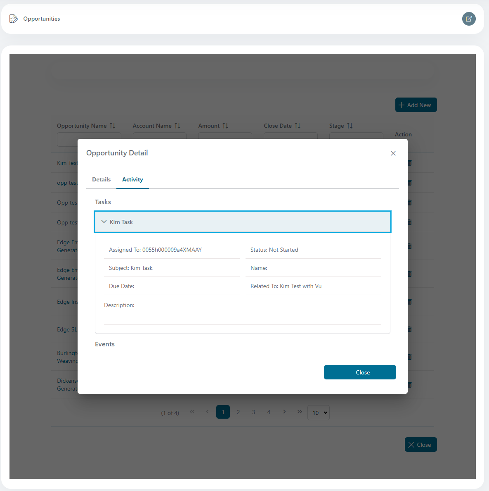

  12. Klickt auf den Ikone "Bleistift" zu verbessern eine Gelegenheit:

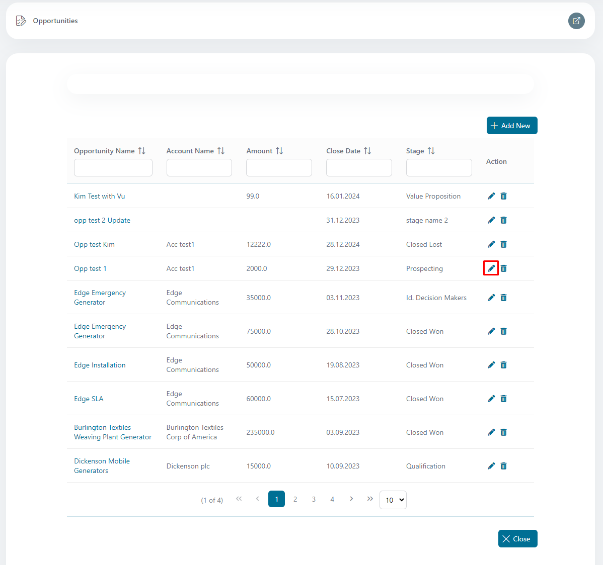

  13. Bearbeitet Gelegenheit:

  14. Klickt auf den Ikone "Kitsch" zu entfernen eine Gelegenheit:

  15. Streich Gelegenheit:

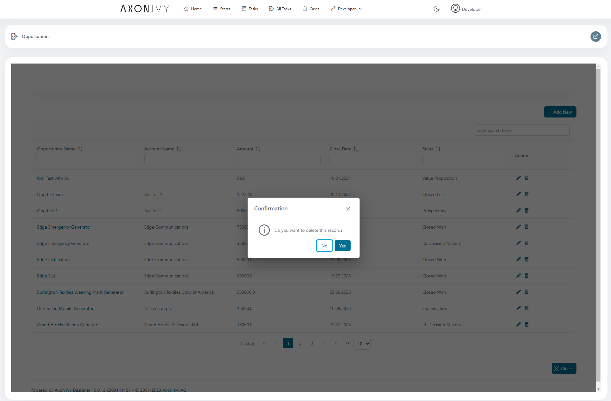

## Einrichtung

### Konfiguration weiter Salesforce unterstützt
Für einen Kunde Antrag zu zugreifen RUHEN API Ressourcen, es muss sein
autorisiert da einem #bewährt Besucher. Zu implementieren diese Berechtigung,
nutz eine **Verbundenes #App** und beschäftigen das **OAuth 2.0** Berechtigung
mündet.

**Wichtige Stufen**

  1. Schaff ein Verbundenes #App zu generieren die nötige Authentifizierung
     Auskunft

- Geh zu **Einrichtung** -> **#App** -> **#App Manager** -> klicken auf
  #zuknöpfen **Neues Verbundenes #App**

  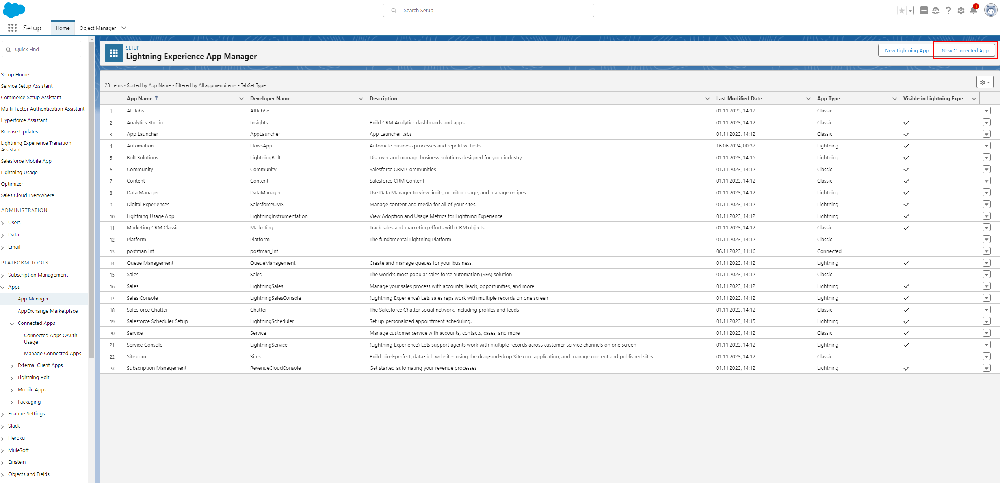

- #Einlesen alle Auskunft gebraucht

  

- Generier Konsumenten #eintasten Und Konsumenten Geheimnis

  

- Konfigurier Kunden #Berechtigungsnachweis mündet

  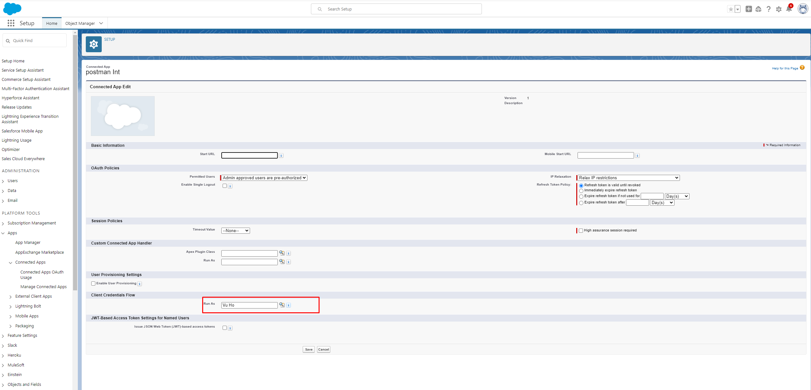

2. Konfigurier Authentifizierung Provider für euren Antrag

- Geh zu **Einrichtung** -> **Auth.Provider** -> **Neu**

  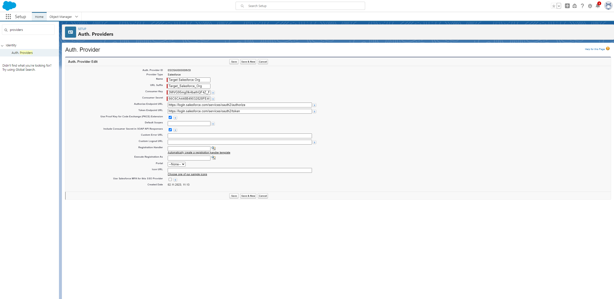

3. Aktivier das bedürften herein Lagen OAuth und OpenID Koppeln Lagen zu
   unterstützen befestigen Authentifizierung

- Geh zu **Einrichtung** -> **OAuth und OpenID Koppeln Lagen** -> Aktivieren
  checkboxes

  

4. Aufgestellt #Namens #Berechtigungsnachweis zu fertigbringen und befestigen
   Zugang zu extern Bedienungen

- Geh zu **Einrichtung** -> **#Namens #Berechtigungsnachweis** -> **Neuen
  Erben**

  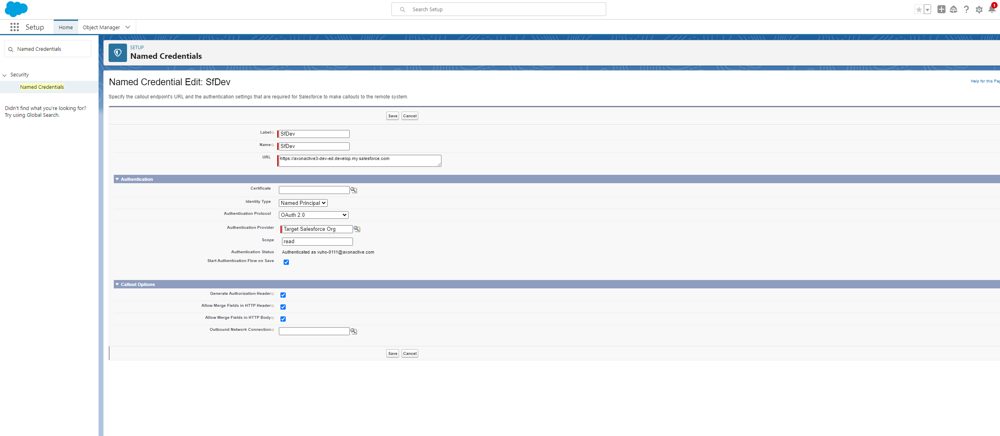

### Integrier den Anschluss hinein eure Projekt
Das **Konsument #Eintasten** und **Konsumenten Geheimnis** ist wiedergewonnen
von das **Verbundenes #App** und plaziert herein das `Variablen.yaml` Feilen.

Authentifizierung Auskunft ist #aufstellen da einer globalen Variable und kann
sein verbessert jederzeit.

| Variabler Name                             | Note                                                                      | Beispiel                                                                         |
| ------------------------------------------ | ------------------------------------------------------------------------- | -------------------------------------------------------------------------------- |
| salesforceConnector.auth.Unterbereich      | Die Domäne jener Salesforce versieht zu Konsumenten für Authentifizierung | axonactive3-dev-ed.Entfalte                                                      |
| salesforceConnector.auth.clientId          | Konsument Id                                                              | 3MVG95mg0lk4bathQF4Z_F1GcZZPr8ztvo29c53HhwOXnCKBkP8LkxHnb5KlydXj3Oomw0VHsY       |
| salesforceConnector.auth.clientSecret      | Konsument Geheimnis                                                       | 56C6CA448B49032828FE4C4DF16D1AF4804B8CC734E066B255A5B31A                         |
| salesforceConnector.auth.useAppPermissions | OAuth2 Grantype                                                           | Wahr (Kunde_#Berechtigungsnachweis)                                              |
| salesforceConnector.auth.url               | Salesforce Ruhen URI                                                      | Https://axonactive3-dev-ed.Entfalte.Mein.salesforce.com/Bedienungen/#Daten/v58.0 |

> [!BEACHTEN] Den variablen Pfad `salesforce-Anschluss` ist #umbenennen zu
> `salesforceConnector` von 13.

### Ressourcen
[Entwickler](https://developer.salesforce.com/docs)

[Verbundenes
#App](https://help.salesforce.com/s/articleView?id=sf.connected_app_client_credentials_setup.htm&type=5)

[Salesforce
SOQL](https://developer.salesforce.com/docs/atlas.en-us.soql_sosl.meta/soql_sosl/sforce_api_calls_soql.htm)

