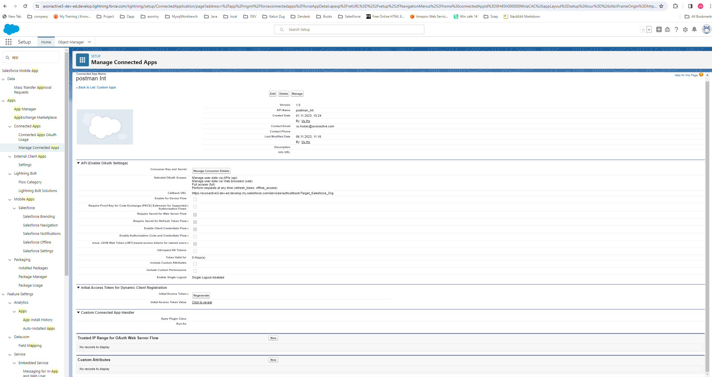
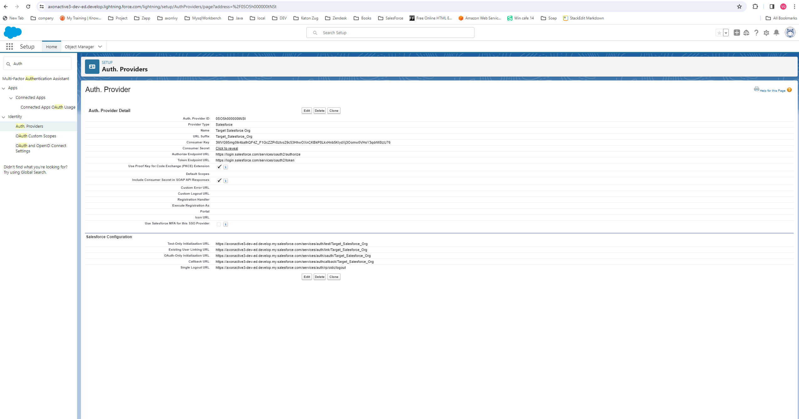
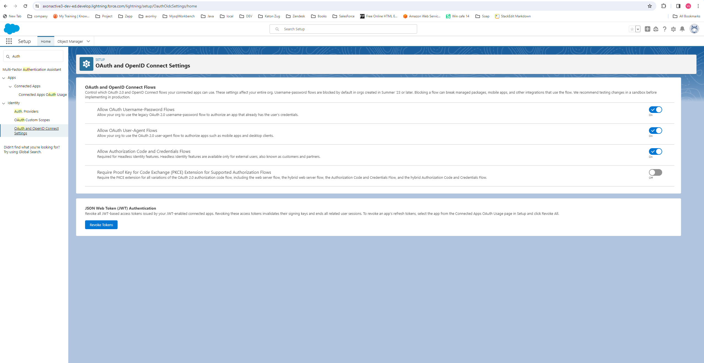
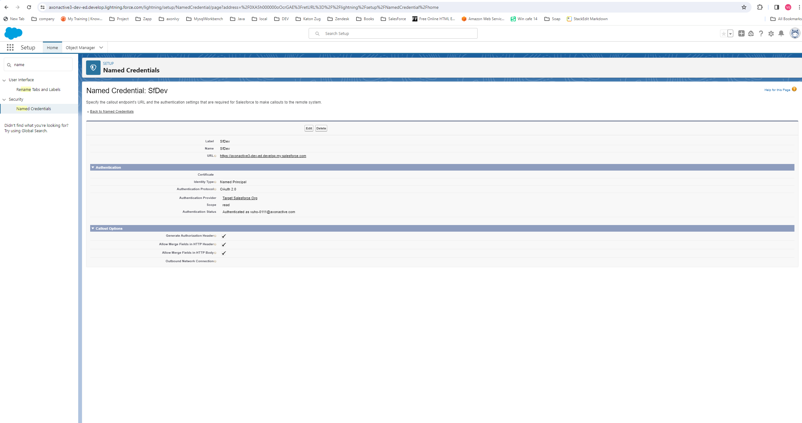

## Setup

### Variables

To use this product, you need to configure multiple variables. Please add the following block to the `config/variables.yaml` file of our main Business Project, which will make use of this product:

```
@variables.yaml@ 
```

Afterwards, set the Consumer Key, Consumer Secret, and App Domain as shown in the Salesforce App setup below.

Example App domain: axonactive3-dev-ed.develop


### Salesforce App

1. Create the Connected App to generate authentication information




2. Set up Auth. Providers



3. Enable some settings for OAuth2.0



3. Set up Named Credentials


